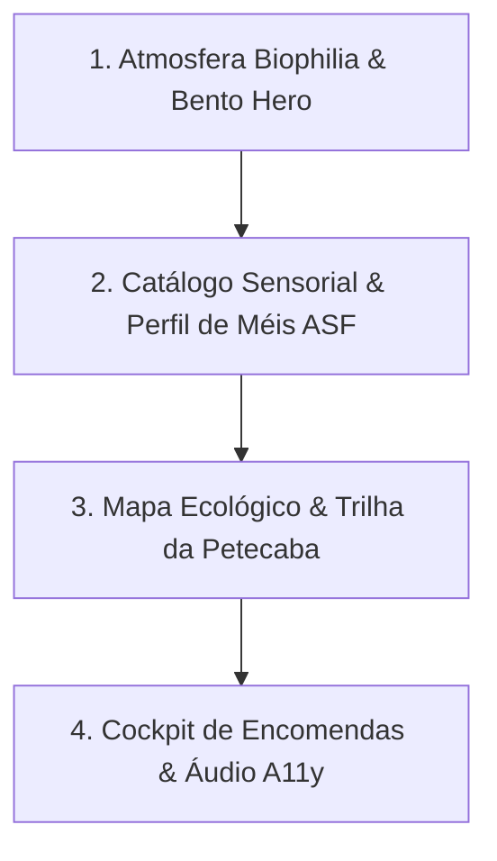

# Plano Mestre de Melhorias Conceituais e Design System: Meliponário Abelha Rainha

**Data**: 15/08/2026  
**Aplicação**: Meliponário Abelha Rainha (Por Ulisses Barbosa)  
**Repositório Local**: `G:\Meu Drive\APP\2. Projetos e Aplicações\2.2 Aplicações e Códigos (GitHub)\Meliponário Abelha Rainha`  
**Contexto**: Pessoal / Sustentabilidade e Preservação Ambiental  
**Tecnologias**: HTML5 Semântico, CSS3 Vanilla (Biophilia & Organic Glassmorphism), JavaScript Moderno ES6+, Leaflet.js / OpenStreetMap, Web Speech API  

---

## 1. Diagnóstico Atual e Visão Estratégica

O website do **Meliponário Abelha Rainha** possui uma base técnica sólida de preservação das Abelhas Nativas Sem Ferrão (ASF) em Petecaba (Candeias, Bahia). No entanto, para transformar a plataforma em uma referência digital de excelência e experiência imersiva, propõe-se uma evolução em **4 pilares conceituais**:

1. **Protagonismo Ecológico & Design Biofílico**: Elevação visual com texturas de favos em SVG, paleta de mel âmbar dourado, verde botânico da Mata Atlântica e contadores dinâmicos de impacto ambiental.
2. **Catálogo Sensorial Interativo**: Fichas biológicas aprofundadas das abelhas (Uruçu, Mandaçaia, Jataí e Iraí) com radar de notas de degustação (acidez, doçura, aroma e textura).
3. **Imersão Geográfica & Rota Ecológica**: Mapa enriquecido no Leaflet com camadas de bioma, pontos de manejo e botão direto de rota via Google Maps / Waze.
4. **Cockpit de Atendimento & Encomendas Sustentáveis**: Seletor de produtos artesanais (méis, própolis, caixas INPA e brindes) com geração de mensagem formatada para o WhatsApp de Ulisses Barbosa.

---

## 2. Especificação dos 4 Módulos de Execução (Prontos para Esforço Low)

### Módulo 1: Atmosfera Biophilia, Hero Bento de Impacto e Refinamento de Tipografia
- **Objetivo**: Modernizar o cabeçalho e a seção Hero com um Cockpit Bento de estatísticas ecológicas e atmosfera de mata viva.
- **Entregáveis Técnicos**:
  1. `index.html`:
     - Atualização do Hero com o **Painel Bento de Preservação** contendo 4 métricas orgânicas:
       * *100% Nativas*: Espécies de abelhas sem ferrão preservadas.
       * *Bioma Mata Atlântica*: Localização preservada na Petecaba (Candeias - BA).
       * *Polinização Ativa*: Mais de 1.500 árvores e plantas nativas visitadas diariamente.
       * *Manejo Racional*: Caixas modulares INPA sustentáveis com colheita higiênica.
  2. `style.css`:
     - Refinamento dos tokens de cores com tons de *Mel Âmbar* (`#D97706`), *Dourado Floral* (`#F59E0B`), *Verde Folha Mata* (`#15803D`) e *Creme Linho* (`#FFFBEB`).
     - Efeitos de brilho orgânico (*Bio Glow*) e textura de favos hexagonais em CSS/SVG com profundidade.
  3. `script.js`:
     - Animação de contagem suave nos números do painel de impacto ao rolar a página (*IntersectionObserver*).

---

### Módulo 2: Catálogo Sensorial de Espécies & Guia do Meliponicultor
- **Objetivo**: Transformar a seção `#abelhas` em uma experiência sensorial e educativa rica sobre as características biológicas e notas de degustação dos méis.
- **Entregáveis Técnicos**:
  1. `index.html`:
     - Novos cards estruturados para as espécies: **Uruçu Nordestina** (*Melipona scutellaris*), **Mandaçaia** (*Melipona quadrifasciata*), **Jataí** (*Tetragonisca angustula*) e **Iraí** (*Nannotrigona testaceicornis*).
     - Seção integrada: **Guia de Cultivo para Iniciantes** ("Qual abelha sem ferrão escolher para seu espaço: Jardim, Varanda ou Sítio?").
  2. `style.css`:
     - Barras de perfil sensorial nos cards (Doçura, Acidez Floral, Densidade e Propriedades Medicinais).
     - Tags botânicas de bioma, raio de voo e mansidão.
  3. `script.js`:
     - Modal interativo aprofundado com foto em alta resolução, hábitos de nidificação e botão de contato contextualizado para a espécie.

---

### Módulo 3: Mapa Interativo de Trilhas Ecológicas & Guia de Floração
- **Objetivo**: Aprimorar o mapa Leaflet de Petecaba com camadas interativas e introduzir o Calendário de Floração Melífera.
- **Entregáveis Técnicos**:
  1. `index.html`:
     - Adição do componente **Calendário Sazonal de Floração na Bahia** (Assa-peixe no inverno, Aroeira na primavera/verão, Manjericão e Frutíferas o ano todo).
     - Botões de ação rápida no mapa: "Abrir Rota no Google Maps", "Traçar Rota no Waze" e "Agendar Visita Técnica".
  2. `style.css`:
     - Estilização personalizada para os popups do Leaflet com estética ecológica (bordas douradas, fundo creme e tipografia Outfit).
  3. `script.js`:
     - Adição de marcadores personalizados no Leaflet para os pontos do meliponário (Berçário de Colmeias, Área de Floração Melífera e Ponto de Recepção).

---

### Módulo 4: Cockpit de Encomendas no WhatsApp & Acessibilidade Universal 360º
- **Objetivo**: Facilitar a solicitação de produtos sustentáveis e garantir inclusão com leitor de voz nativo e atalhos de teclado.
- **Entregáveis Técnicos**:
  1. `index.html`:
     - Adição da seção **Seletor de Encomendas & Kits Ecológicos**:
       * *Kit Degustação de Méis Nativos* (Potes 100g de Uruçu e Jataí).
       * *Extrato Puro de Própolis de Abelha Sem Ferrão*.
       * *Caixa Isca / Módulo Racional INPA para Iniciação*.
       * *Brindes e Papelaria Ecológica Oficial*.
  2. `script.js`:
     - Motor de composição automática da mensagem do WhatsApp, formatando os itens selecionados e direcionando diretamente para Ulisses Barbosa (`71 99272-4330`).
     - Integração do sintetizador de voz nativo via Web Speech API (`window.speechSynthesis`) com botão "Ouvir Descrição da Espécie".
     - Atalhos de acessibilidade: `Alt + 1` (Conteúdo Principal), `Alt + 2` (Alto Contraste) e `Alt + 3` (Mapa/Localização).

---

## 3. Matriz de Cores e Tokens CSS Propostos

| Token | Valor Hex / HSL | Finalidade e Aplicação |
| :--- | :--- | :--- |
| `--bg-amber-light` | `#FFFBEB` | Fundo principal da página (Creme Linho Orgânico) |
| `--primary-honey` | `#D97706` | Destaques nobres, títulos secundários e botões principais |
| `--accent-forest` | `#15803D` | Verde botânico da Mata Atlântica para sustentabilidade e badges |
| `--text-wood` | `#78350F` | Cor do texto principal para leitura agradável e sem fadiga visual |
| `--contrast-bg` | `#000000` | Fundo no modo Alto Contraste AAA |
| `--contrast-yellow`| `#FFFF00` | Amarelo de alto contraste para conformidade WCAG |

---

## 4. Ordem de Implementação Sugerida

1. **Módulo 1**: Hero Bento de Impacto, Estatísticas Ecológicas e Tokens Biophilia.
2. **Módulo 2**: Catálogo Sensorial de Espécies ASF e Perfil de Sabor dos Méis.
3. **Módulo 3**: Mapa com Rotas Waze/Google Maps e Calendário de Floração.
4. **Módulo 4**: Seletor de Encomendas para WhatsApp e Leitor de Voz A11y.
